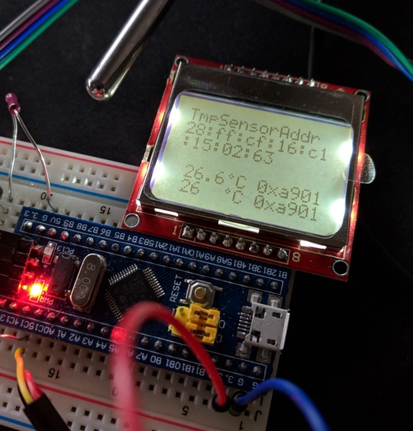

# pcd8544 - Display driver crate

This crate implements the `Write` trait so that one can write text to the display.


[](https://github.com/kellerkindt/pcd8544/actions?query=workflow%3ARust)
[](https://github.com/kellerkindt/pcd8544)
[](https://crates.io/crates/pcd8544)
[](https://docs.rs/pcd8544)
[](https://github.com/kellerkindt/pcd8544/issues/new)

# How to use
Below is an example how to create a new PCD8544 instance, initialize and write "Hello World" onto it.

```rust
fn main() -> ! {
    let mut cp: cortex_m::Peripherals = cortex_m::Peripherals::take().unwrap();
    let mut peripherals = stm32f103xx::Peripherals::take().unwrap();
    let mut rcc = peripherals.RCC.constrain();
    
    let mut gpioa = peripherals.GPIOA.split(&mut rcc.apb2);
    let mut gpiob = peripherals.GPIOB.split(&mut rcc.apb2);
    
    let mut pcd_gnd   = gpiob.pb12.into_push_pull_output(&mut gpiob.crh);
    let mut pcd_light = gpiob.pb13.into_push_pull_output(&mut gpiob.crh);
    let mut pcd_vcc   = gpiob.pb14.into_push_pull_output(&mut gpiob.crh);
    let mut pcd_clk   = gpiob.pb15.into_push_pull_output(&mut gpiob.crh);
    let mut pcd_din   = gpioa.pa8 .into_push_pull_output(&mut gpioa.crh);
    let mut pcd_dc    = gpioa.pa9 .into_push_pull_output(&mut gpioa.crh);
    let mut pcd_ce    = gpioa.pa10.into_push_pull_output(&mut gpioa.crh);
    let mut pcd_rst   = gpioa.pa11.into_push_pull_output(&mut gpioa.crh);


    pcd_gnd  .set_low();
    pcd_light.set_high();
    pcd_vcc  .set_high();

    let pcd_spi = spi::BitBangSpi::new_with_delay(pcd_clk, pcd_din).unwrap();

    let mut display = PCD8544::new(
        pcd_spi,
        pcd_dc,
        pcd_ce,
        pcd_rst,
        pcd_light,
    ).expect("Infallible cannot fail");

    display.reset().expect("Infallible cannot fail");;
    writeln!(display, "Hello World");
    
    loop {}
}
```
The code from the example is copy&pasted from a working project, but not tested in this specific combination.

## More examples
There are in-depth examples in the platform-examples folder, for Bluepill and Rasperry Pico boards.
You can compile them by going into their directory (platform-examples/rp-pico for example) and run `cargo build --examples`.
There is also a general example in the examples directory, which you can compile running the examples build command in the root dir of the project.

#### In action
The picture below shows the display to showing the temperature from the [onewire](https://github.com/kellerkindt/onewire/) [ds18b20](https://datasheets.maximintegrated.com/en/ds/DS18B20.pdf) sensor.
 


# Note about the difference between PCD8544 dev boards

There are a lot of different dev boards in the market with the PCD8544. 
The screen package with the PCD8544 chip is the same everywhere and are mostly refurbished
phone screens. Backlights however are not an integral part of the screen package and have very
different implementations per devboard manufraturer. You have white backlights, blue
backlights, and differences in how to drive the backlights.
Pin layout on the baseboard (back pcb) of the screen can also differ.

Populair boards are of course the following:
[Adafruit](https://www.adafruit.com/product/338)
[Sparkfun](https://www.sparkfun.com/products/10168)
but there are a lot of other variants in the market.

The Adafruit board has white leds and you need to put the LIGHT pin HIGH to turn backlight ON.
It also advices to put 5v on LIGHT for a brighter experience. It has some protection for
overcurrent build in and uses a transistor

The Sparkfun board also has white leds but doesn't use any kind of protection. The leds are
directly connected to your pins. Be careful with this one, do not put 5V on this board!
I believe this is also put LIGHT pin to HIGH for backlight ON

There are other numerous noname boards. The testboard for the platform-examples dir was a noname board.
It has blue backlights and LIGHT pin to LOW for backlight to turn ON. So you need to ground the LIGHT pin.
LEDs are basically connected internally to VCC and LIGHT. This is a little weird but it works.
And blue leds have the added advantage of much lower power consumption than white ones.

